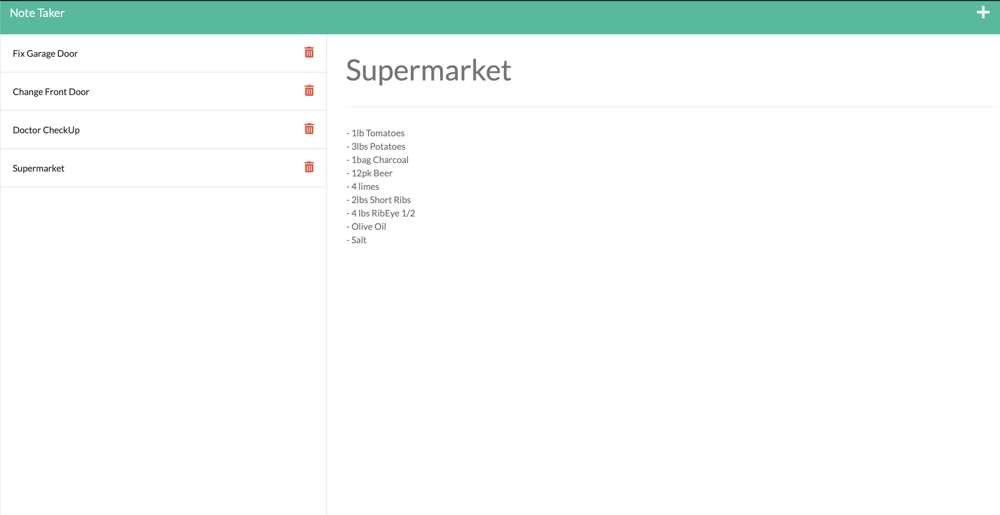
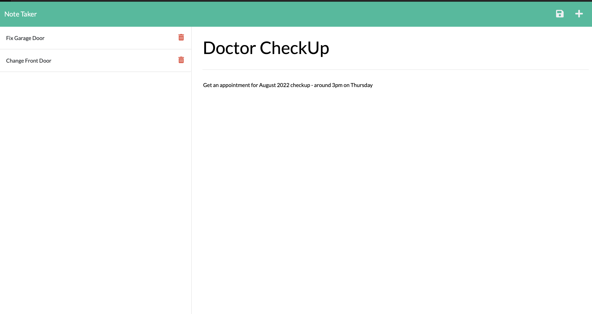

# 11NoteTakerHRK
Note Taker App deployed in Heroku


## Locations 

GitHub Repo: https://github.com/J28819/11NoteTakerHRK


## Local Installation

1. To clone the repository in your computer run this command.

```bash
git clone git@github.com:J28819/11NoteTakerHRK.git
//go to the foler
npm init
npm install --save express
node index.js

```

2. Then open it with Visual Code and run node index.js

3. This Page run in Heroku Cloud


## Description

- This Application use the Notes Taker Frameworks and with Routes you can create or delete Notes with Title and Note Text
- The Application is deployed in Heroku and is full functional
- All notes are saved in a json file 


## Acceptance Criteria

```md
GIVEN a note-taking application
WHEN I open the Note Taker
THEN I am presented with a landing page with a link to a notes page
WHEN I click on the link to the notes page
THEN I am presented with a page with existing notes listed in the left-hand column, plus empty fields to enter a new note title and the note’s text in the right-hand column
WHEN I enter a new note title and the note’s text
THEN a Save icon appears in the navigation at the top of the page
WHEN I click on the Save icon
THEN the new note I have entered is saved and appears in the left-hand column with the other existing notes
WHEN I click on an existing note in the list in the left-hand column
THEN that note appears in the right-hand column
WHEN I click on the Write icon in the navigation at the top of the page
THEN I am presented with empty fields to enter a new note title and the note’s text in the right-hand column
```


## Screenshoots
Overview


Overview2


## Heroku Deployment

https://dashboard.heroku.com/apps/notetakerhrk


## Conclusion 

 Thank you to all the GTBootcamp staff for all the support and teaching that makes this possible.


## License
[MIT](https://choosealicense.com/licenses/mit/)


